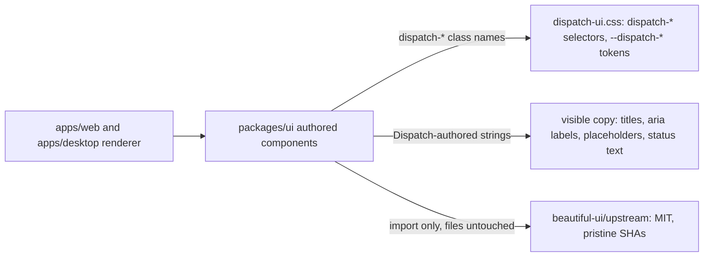

# Intent of the change

- Make `@trytilde/dispatch-ui` own every identifier and every user-visible string it ships. No naming inherited from the reference build the components were recovered from.
- Move the workspace class families onto the `dispatch-` prefix already used by the package's `--dispatch-*` design tokens. One prefix, one owner.
- Reword carried-over interface copy — aria labels, panel titles, status lines, permission dialog text, composer placeholder — into Dispatch wording.
- Remove the hardcoded personal-name account placeholder from the sidebar.
- Leave the MIT-licensed `beautiful-ui/upstream/` tree pristine so the per-file SHA-256 values in `packages/ui/src/beautiful-ui/PROVENANCE.md` still verify.
- Rename and reword only. No behavior, no markup structure, no component API change.

# Architecture changes

Boundaries unchanged. Ownership of names and strings changed.

- `dispatch-` is now the single class prefix for Dispatch-authored UI. It matches the `--dispatch-*` custom properties that already existed in `dispatch-ui.css`; the file previously mixed `--dispatch-*` tokens with `ui-*` selectors.
- Renamed families: `ui-markdown__*`, `ui-code-block*`, `ui-default-code*`, `ui-default-diff*`, `ui-mermaid-diagram*`, `ui-expandable-node__*`, `ui-dialog*`, `ui-status-badge`, `ui-indicator-dot`, `ui-kbd`, `ui-input-group__*`, `ui-select-*`, `ui-scroll-area__*`, `ui-text-roll__*`, `ui-voice-waveform`, `ui-model-picker__*`.
- Not renamed: `ui-sans-serif` and `ui-monospace` in the `--font-sans` / `--font-mono` stacks. Those are CSS generic font-family keywords, not class names.
- Not renamed: structural class names that were already Dispatch-authored — `diagram-card`, `diagram-modal-*`, `dialog-layer`, `dialog-surface`, `agent-row-marker`, `local-tool-permission-dock`, `markdown`, `md-citation-btn`. Several elements keep a structural class plus the renamed `dispatch-` class.
- `beautiful-ui/upstream/` is outside this change. Its files carry a third-party MIT license and recorded hashes; renaming inside them would break `PROVENANCE.md` verification.
- No DOM structure, no props, no exported symbol, no CSS declaration value changed. Pure identifier and string substitution.

# Summarized package changes

- `packages/ui/src/dispatch-ui.css` — 100 selector renames `ui-*` → `dispatch-*` across markdown, code block, diff, badge, dot, kbd, input group, select, scroll area, text roll, voice waveform, and model picker rules. Font-family keywords untouched.
- `packages/ui/src/markdown-components.tsx` — 40 class renames. Full markdown element map (`h1`–`h6`, lists, tables, links, images, inline code, blockquote, hr, task marker) plus code block and diff block shells.
- `packages/ui/src/primitive-components.tsx` — 25 class renames: status badge, indicator dot, kbd, input group, select, scroll area, text roll, voice waveform, model picker trigger and menu.
- `packages/ui/src/content-components.tsx` — 10 class renames (code block, mermaid diagram, expandable-node modal); copy: computer takeover aria label and button, request-skip tooltip.
- `packages/ui/src/overlay-components.tsx` — 6 class renames (dialog backdrop, surface, header, title, description, footer); copy: permission dialog action label, dialog and dock aria labels, dismiss tooltip, agent handoff label.
- `packages/ui/src/computer-components.tsx` — copy only: lifecycle status lines, retry action labels, long-running notice title and body, screen menu aria label.
- `packages/ui/src/activity-panels.tsx` — copy only: background-tasks and conversation-outline panel titles and their agent-scoped aria labels.
- `packages/ui/src/chat-components.tsx` — copy only: the two panel toggle titles, kept in sync with `activity-panels.tsx`.
- `packages/ui/src/agent-workspace-panel.tsx` — copy only: takeover/release button label, computer-starting status line.
- `packages/ui/src/chat-composer.tsx` — copy only: composer placeholder.
- `packages/ui/src/sidebar-components.tsx` — copy only: unread-marker aria label; hardcoded personal-name account default replaced with `"Your account"`.
- `packages/ui/src/workspace-sidebar.tsx` — copy only: resize handle aria label.
- No changeset. No ADR. No documentation file changed in this PR.

# Critical to apply to forks

yes

**A fork that styles or selects `@trytilde/dispatch-ui` markup breaks silently.** Every `ui-*` class the package renders is now `dispatch-*`. A fork-owned stylesheet, theme override, snapshot test, Playwright locator, or `querySelector` targeting `.ui-markdown__link`, `.ui-code-block`, `.ui-model-picker__menu`, `.ui-dialog`, `.ui-input-group__input`, `.ui-scroll-area__viewport`, `.ui-status-badge`, `.ui-text-roll__item`, or any sibling name stops matching. This is not a type error and not a lint error — `pnpm typecheck` and `pnpm lint` stay green while the fork's styling silently drops. Rewrite those selectors `ui-` → `dispatch-`.

**Do not blanket-replace `ui-` in CSS.** `ui-sans-serif` and `ui-monospace` are generic font keywords in the `--font-sans` and `--font-mono` stacks. Renaming them breaks font resolution. Scope the replacement to class selectors.

**Do not rename inside `packages/ui/src/beautiful-ui/upstream/`.** Those files are third-party MIT source with per-file SHA-256 recorded in `packages/ui/src/beautiful-ui/PROVENANCE.md`. Any edit there invalidates the recorded hashes. A fork that already modified them must record the modification in that file instead.

**Visible strings changed.** Any fork test or automation matching on accessible name or text — background-tasks and conversation-outline panels, the computer takeover control, tool permission actions and docks, computer lifecycle status and retry labels, composer placeholder, sidebar resize handle, unread marker — must be updated. A fork carrying its own translations or copy overrides for these surfaces must re-point them at the new strings.

**Sidebar account default changed.** The account name default is `"Your account"`, not a person's name. A fork relying on the old default to render a demo identity must pass its own `name` prop.

**Keep the boundary.** Do not reintroduce reference-build class names or interface copy when merging upstream or reapplying local patches. Dispatch-authored surfaces carry Dispatch-authored names and Dispatch-authored wording.

Run `pnpm typecheck` and `pnpm lint`, then visually verify the workspace, markdown rendering, code blocks, dialogs, and model picker — the renames are invisible to static checks.
