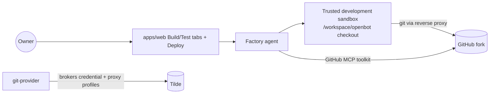

# 45: Factory agent, git provider, and the build/test/deploy loop

## Intent

Make the primary agent the installation's factory: the agent every owner talks to when they want
to create, test, and deploy other agents. The factory agent works inside the trusted development
sandbox, which now carries the owner's fork as a real git checkout authenticated through Tilde —
no GitHub token ever enters the repository or a Computer.

## Shape

## Changes

- New `@tryopenbot/git-provider` (`GitProvider` contract, `GitHubGitProvider` adapter). Deploy
  idempotently ensures the Tilde GitHub tool group (`server_token_exchange` via
  `provider_provisioner.github`), surfaces pending authorization as a
  `git.github.authorization.required` event, and reconciles the `openbot-github-rest`
  (api.github.com) and `openbot-github-git` (github.com) reverse-proxy profiles, persisting
  `GIT_GITHUB_*` environment names. This pays down the ADR-0013 debt note about a future
  code-forge/`GitProvider` domain.
- Init asks for the fork repository (`GIT_GITHUB_REPOSITORY`) and constructs the provider in both
  configuration templates; `providers.git` is an optional composition slot.
- The primary agent is now `factory` (display name "Factory"). Shared agent templates no longer
  scaffold skills into every subagent; factory-only skills (`create-agent`, `test-agent`,
  `deploy-agent`, `develop-openbot`) seed `configuration/templates/factory/` and render only into
  the primary agent.
- The trusted development sandbox attaches its seeded source to the fork: git identity, an
  `insteadOf` rewrite of `https://github.com/` through the Tilde git proxy with the team API key
  headers, `origin` and `upstream` remotes, and a tolerant initial fetch. `openbot dev` now also
  reconciles the development sandbox.
- The factory agent's computer tools run in the development sandbox via the new per-agent
  `AGENT_<ID>_COMPUTER_SERVICE_URL` override (persisted from
  `DEVELOPMENT_SANDBOX_SERVICE_URL` for the primary agent).
- The tools reconciler enables the brokered GitHub toolkit for the primary agent only
  (`DeploymentContext.agentKind`).
- Web workspace: sidebar "New agent" entry starts a factory conversation; selecting a subagent
  shows a floating Build/Test pill (Build = factory session titled `Build: <name>`, Test = the
  agent itself over its local-runtime tunnel registration); a Deploy action fades in while the
  agent's ChatKit registration still has `local_running_endpoint` and sends the factory agent a
  commit/push/PR/deploy instruction, then polls until the registration flips to the deployed
  endpoint.

## Fork migration

1. Pull this update, run `pnpm install`, then `pnpm openbot init` to answer the new GitHub
   repository question; init preserves existing agents (the primary keeps its directory, only new
   scaffolds use the `factory` ID).
2. Forks initialized before this change keep a `configuration/agent` tree scaffolded as
   hello-world; the discovery ID for the primary is now `factory`, so redeploy agents once
   (`pnpm openbot deploy --yes --service agents`) to register the renamed primary.
3. Complete the GitHub App authorization surfaced during the first deploy
   (`git.github.authorization.required` event), then rerun the deploy to reconcile the reverse
   proxy profiles and the sandbox git remotes.
