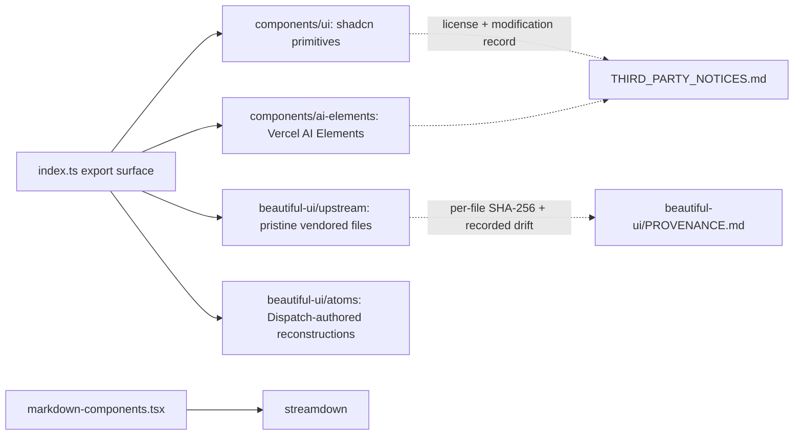

# Intent of the change

- Base of a 7-PR stack rebuilding the workspace UI. Component foundation only. No product surface change yet.
- Rebuild on vendored, repository-owned component sources: shadcn/ui primitives, the Beautiful UI set, Vercel AI Elements. Visual target is the reference build; no code taken from it — vendored libraries are the implementation.
- Fix the earlier Beautiful UI vendoring. The 2026-08-12 copy came from a stale third-party mirror. Re-retrieved 2026-08-17 from the live site's published component source. Per-file SHA-256 recorded so drift stays explainable.
- Move markdown rendering from `react-markdown` to Streamdown. Streaming-safe markdown for agent output.

# Architecture changes

- Three vendored layers, one discipline. `upstream/` stays pristine except recorded drift (analytics call removed, import paths rewritten); every file's retrieval SHA-256 lives in `PROVENANCE.md`. `atoms/` (Button, GlideMenu, Shimmer, StreamText) are Dispatch-authored reconstructions — upstream never published its atom source. shadcn and AI Elements copies record their modifications in `THIRD_PARTY_NOTICES.md`.
- `components.json` pins the shadcn registry config (new-york style, lucide, `src/components/ui` alias) so later `shadcn add` pulls land in the same tree.
- shadcn `accent` utilities remapped to `hover`/`ink` tokens because Beautiful UI already owns `--color-accent`. `dialog.tsx`, `command.tsx`, `dropdown-menu.tsx` are Dispatch-authored on Radix/cmdk, not registry copies.
- Superseded upstream duplicates removed: `chat.tsx` → `chat-composer.tsx`, `thinking.tsx` → `thinking-state.tsx`.
- Two modules land here inert, wired later in the stack: `theme.ts` (activated by PR 51) and `agent-avatar-assets.ts` (consumed by PR 52). Stack-split artifact, deliberate.
- Not vendored: upstream `insight-cards` and `selection-actions` (extra dependencies). Re-extract the same way if needed.

# Summarized package changes

- `packages/ui` — new trees `src/components/ui/` (15 shadcn primitives), `src/components/ai-elements/` (8 chat components), `src/beautiful-ui/upstream/` refreshed from live source plus new `atoms/`. `index.ts` export surface grows (Command/Dialog/DropdownMenu groups, AI Elements groups, atoms, `cn`, theme API module added but unexported here). `markdown-components.tsx` rewritten on Streamdown with token utility classes; `dispatch-code-block*` class markup gone. Dependencies added: `radix-ui`/`@radix-ui/*`, `cmdk`, `streamdown` + `@streamdown/{cjk,code,math,mermaid}`, `shiki`, `motion`, `class-variance-authority`, `clsx`, `tailwind-merge`, `lucide-react`, `glimm`, `ai`, `nanoid`, `use-stick-to-bottom`. Removed: `react-markdown`, `remark-gfm`. `components.json` new. Stories updated.
- `THIRD_PARTY_NOTICES.md` (root) — Beautiful UI, shadcn/ui, Vercel AI Elements, glimm entries with license and modification records.
- `pnpm-lock.yaml` — dependency swap fallout (~4000 lines).

# Critical to apply to forks

yes

**Renamed public deep imports.** `@trytilde/dispatch-ui/beautiful-ui/*` is an exported wildcard. `beautiful-ui/chat` and `beautiful-ui/thinking` no longer resolve — the files are now `chat-composer.tsx` and `thinking-state.tsx`. Update deep imports; the root exports `BeautifulChatComposer` and `ThinkingState` unchanged.

**Removed dependencies.** `react-markdown` and `remark-gfm` left `@trytilde/dispatch-ui`. Fork code that imported them transitively must declare its own dependency or move to Streamdown.

**Markdown markup changed.** `CodeBlock` and friends dropped the `dispatch-code-block*` class names for token utilities. Fork CSS targeting those selectors stops matching. Restyle against the token utilities (PR 51 defines the palette).

**Vendored-tree discipline.** Do not edit `beautiful-ui/upstream/` in a fork without recording the change in `PROVENANCE.md`; the per-file SHAs are the audit trail. Fork-authored composition belongs outside `upstream/`.

Run `pnpm install`, then `pnpm typecheck` and `pnpm lint`.
