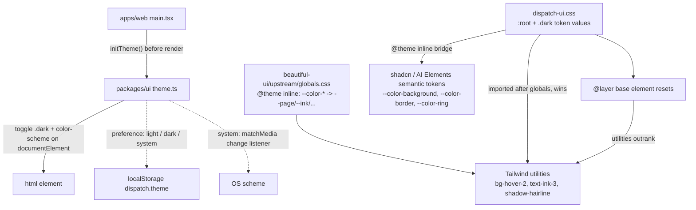

# Intent of the change

- Give the workspace UI one palette with two schemes. Second PR of the 7-PR stack. Foundation, not surface.
- Own the token *values*. PR 50 vendored the component sources and their `@theme inline` utility mapping; the colours themselves were never Dispatch's. Now they are.
- Activate dark mode. `.dark` existed in the vendored `beautiful-ui/upstream/globals.css` and in `theme.ts` (landed inert in PR 50); nothing ever toggled the class. `initTheme()` in the web entry does.
- Fix a cascade defect. Bare `button`/`h1` element resets outranked component utilities. `text-[12.5px]` on a `<button>` silently lost. Resets move into `@layer base`.
- Delete workspace CSS the stack supersedes. ~950 lines, including duplicated rule blocks.

# Architecture changes

- Two files, one palette. The vendored `globals.css` owns the utility *mapping* (`--color-ink: var(--ink)`); `dispatch-ui.css` owns the *values* (`--ink: #141414` / `#fcfcfc`). Import order is the mechanism — no edit to the vendored tree, so `PROVENANCE.md` hashes stay valid.
- Semantic names, not colour names. Surfaces `--page`/`--canvas`/`--surface`/`--inset`/`--field`, ink levels `--ink`/`--ink-2`/`--ink-3`, `--line`/`--line-strong`, alpha fills `--hover`/`--hover-2`, bubbles, tooltip, status tints, six shadow tokens. Every downstream component in the stack styles against these names.
- Alpha fills on grey (`#777777xx`) for hover and selected, not solid greys. Holds on any surface underneath.
- Dark mode carries elevation with fills and borders. Every shadow token — `--shadow-btn`, `--shadow-card`, `--shadow-raised`, `--shadow-overlay` — collapses to a hairline under `.dark`. No drop shadow in dark.
- Second `@theme inline` block bridges shadcn/AI Elements semantic names onto the palette: `--color-background: var(--page)`, `--color-border: var(--line)`, `--color-ring: var(--accent)`. shadcn `accent` is not bridged; PR 50 remapped those utilities to `hover`/`ink` because Beautiful UI owns `--color-accent`.
- Class-based theming, not `prefers-color-scheme` media queries. A media query cannot express an explicit user override. `theme.ts` sets `color-scheme` alongside the class so native form controls and scrollbars follow.
- `theme.ts` degrades on `localStorage` failure (private mode) to `system`. No throw.
- Font stacks retargeted: `--font-inter` leads with `SF Pro` and platform faces; `--font-mono-face` gains the full monospace fallback chain.
- Deleted rules are the sidebar/search/account/message surfaces the stack rewrites onto utilities: `.agent-row`, `.chat-search`, `.chat-sorters`, `.agent-navigation`, `.rail-footer`, `.account-menu`, `.sidebar-actions`, `.load-more-agents`, `.sidebar-search-overlay`. Their consumers migrate in PR 53 and later. This commit alone leaves those surfaces unstyled — stack-split artifact, deliberate.

# Summarized package changes

- `packages/ui` — `dispatch-ui.css` rewritten at the top: `@theme inline` shadcn bridge, `:root` and `.dark` Sand palette (~50 tokens each), element resets wrapped in `@layer base`. Net −950/+323 lines. `index.ts` exports `initTheme`, `getThemePreference`, `setThemePreference`, `type ThemePreference` from `theme.js`; the module itself is unchanged from PR 50.
- `apps/web` — `main.tsx` calls `initTheme()` at module scope before `createRoot`, so the class is on `documentElement` before first paint. No other entry point calls it; `apps/desktop` packages the web build and inherits it.
- No new dependency. No lockfile change.

# Critical to apply to forks

yes

**Removed CSS class rules.** ~950 lines gone from `dispatch-ui.css`. A fork whose own markup or overrides target `.agent-row`, `.chat-search`, `.chat-sorters`, `.agent-navigation`, `.rail-footer`, `.account-menu`, `.account-menu-section`, `.sidebar-actions`, `.load-more-agents`, `.sidebar-search-overlay`, or `.sidebar-search-dialog` loses the base rules those overrides extended. Restyle against the token utilities.

**Do not take this PR alone.** It deletes styling for surfaces that only get their replacement markup in PR 53 and PR 54. Cherry-picking 51 without the rest of the stack leaves the sidebar, search dialog, and account footer unstyled. Take 50–56 as one unit.

**Token values changed, token names did not — mostly.** `--page`, `--ink`, `--line`, `--field`, `--accent` and friends keep their names but now resolve to Dispatch's hex values instead of the vendored oklch ramp. Fork screenshots and any pinned colour assertions change. New names a fork can now rely on: `--hover-2`, `--ink-3`, `--line-strong`, `--stripe`, `--stripe-bg`, `--bubble-*`, `--tooltip-*`, `--scrim`, `--shadow-*`.

**Dark mode is now reachable.** Any fork surface that hardcodes a light colour, or assumes a drop shadow reads as elevation, breaks under `.dark`. Audit fork components for literal hex values and for shadows used as the only elevation cue — in dark every shadow token is a hairline.

**A fork entry point that is not `apps/web` must call `initTheme()` itself.** Importing `@trytilde/dispatch-ui/dispatch-ui.css` is not enough; nothing toggles the class without it. `apps/mobile` keeps its own component tree and is not covered.

**Element resets moved into `@layer base`.** A fork stylesheet that relied on a bare `button { font: inherit }` beating a utility class now loses that fight. Intended, but it changes rendering where a fork depended on the old order.

Run `pnpm install`, then `pnpm typecheck` and `pnpm lint`. Load the workspace in both schemes before shipping.
