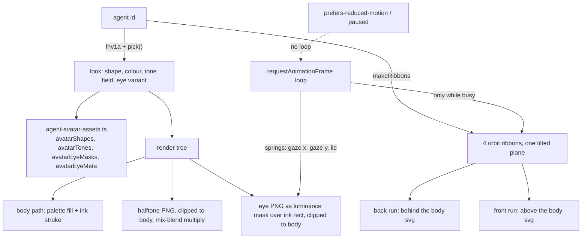

# Intent of the change

- Replace the flat coloured silhouette with a drawn agent avatar. Third PR of the 7-PR stack.
- Give an agent a stable identity across the app. Everything — shape, body colour, tone field, eye variant, orbit ribbons — derives from the agent id by hash. No storage, no server field.
- Make the avatar say what the agent is doing. Eight states; four of them spin an orbit.
- Consume `agent-avatar-assets.ts`, which landed inert in PR 50. Art is base64 in source, so there is no runtime asset fetch and web and desktop builds render identically.

# Architecture changes

- Three stacked SVGs, not one. Orbit-back, body, orbit-front, ordered by `zIndex`. Each ribbon sample is assigned to the back or front run by its depth, so the body sits *inside* the orbit rather than under a flat ring.
- Tone is a halftone dot field scaled to overhang the shape (`-30 … 300` in a 228-unit box), clipped to the body path, multiplied over the colour: white areas keep the colour, dots print as ink. Only fields with coverage ≤ 0.25 are used — denser ones go sub-pixel at 36 px and read as a dark wash, not texture.
- Eyes are drawn artwork used as a luminance mask over a solid ink rect. All variants share one crop box (`avatarEyeMeta`), so relative geometry is exactly as drawn; only the per-shape `eyeY`/`gap` in the local `FACE` table places them.
- One `requestAnimationFrame` loop drives everything. Gaze and lid are critically-ish damped springs, sub-stepped at 120 Hz so the integration is frame-rate independent. Blink is a lid spring kicked to 1, not a keyframe. Orbit is redrawn only while busy.
- Motion is opt-out twice: `paused` prop and `prefers-reduced-motion: reduce`. Both skip the loop entirely — no animation frames scheduled.
- SVG `url(#id)` references need plain ASCII, so the component mints its own monotonic uid per instance for the clip path and mask ids. React's `useId` output is not usable there.
- `agent-avatar-shapes.ts` deleted. Its silhouettes are carried into the assets module; the outlines themselves are unchanged, redrawing them is a designer task, not a refactor.
- Colour moved from CSS custom properties to the SVG. The old component set `--agent-avatar-fill-dark`/`-light` and let the stylesheet pick; the new one fills the path directly from a ten-entry saturated palette chosen to stay legible after the halftone multiplies over it. No light/dark variant per colour — the ink stroke and tone do the work in both schemes.

# Summarized package changes

- `packages/ui` — `agent-avatar.tsx` rewritten (+357/−56). New exports from the module: `AgentAvatarState`, `agentAvatarPalette`, `shapeNames`, `AgentAvatarShapeName`. `AgentAvatarProps` gains optional `state`, `paused`, `className`, `color`, `shape`, `emphasis`; `id` stays required. `agent-avatar-shapes.ts` deleted (−61). `index.ts` untouched — only `AgentAvatar` and `AgentAvatarProps` are on the package's public surface; the new named exports are internal to the package.
- No dependency change, no CSS change, no lockfile change. The 224 KB asset module it consumes already shipped in PR 50.

# Critical to apply to forks

no

Additive for every documented consumer. `AgentAvatarProps.id` is unchanged and every new prop is optional, so `<AgentAvatar id={…} />` keeps working. `agentAvatarShapes` was never exported from the package index, so deleting `agent-avatar-shapes.ts` breaks no public import.

Two things a fork should still check:

- **Deep import of the deleted module.** A fork that reached past the index for `./agent-avatar-shapes.js` — or copied it — no longer resolves. The silhouettes live in `agent-avatar-assets.ts` as `avatarShapes`, keyed the same eight names, with the path under `d` instead of `path`.
- **CSS that styled the avatar.** `--agent-avatar-fill-dark` and `--agent-avatar-fill-light` are no longer set, and the body fill is now an SVG attribute. Fork rules recolouring `.agent-avatar-body` through those variables stop having an effect. Sizing still comes from the wrapper (`size-9`, 36 px) and the `.avatar` / `.agent-avatar-mark` selectors.

Run `pnpm typecheck` and `pnpm lint`.
