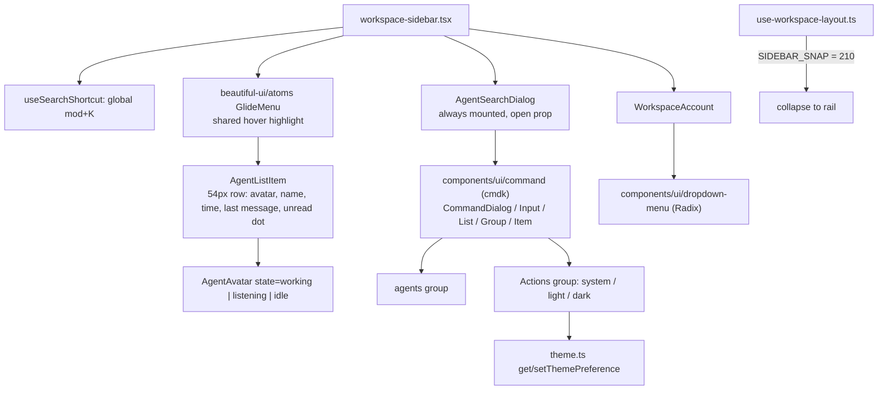

# Intent of the change

- First surface PR of the 7-PR stack. Sidebar, account menu, and search dialog stop being hand-rolled CSS and become compositions of the vendored components over the PR 51 tokens.
- Replace the bespoke search overlay with the vendored cmdk command palette, and give it an *Actions* group — theme switching, the first in-product use of the PR 51 theme controller.
- Replace the hand-rolled account dropdown (outside-pointer listener, escape handler, `useId` wiring) with the vendored Radix dropdown. Delete the accessibility plumbing rather than maintain it.
- Reclaim the CSS PR 51 deleted. Those surfaces had no rules left; this PR supplies their utilities.

# Architecture changes

- Styling moves from stylesheet selectors to token utilities on the elements: `bg-hover-2`, `text-ink-3`, `shadow-hairline`, `rounded-control`. The token names are PR 51's; the utility mapping is the vendored `@theme inline` block. No new CSS rule is added for these surfaces.
- Dialog lifecycle inverts. The search dialog used to be conditionally rendered by the parent; it is now always mounted and takes an `open` prop, because cmdk's `CommandDialog` owns its own mount/unmount transitions. `onOpenChange(false)` funnels back into the existing `onClose`.
- Filtering stays in OpenBot, not cmdk. `commandProps={{ shouldFilter: false }}` — the agent list is already filtered by the caller through `value`/`onChange`, and only the *Actions* group filters locally against its own label and keyword strings. Two filters over one list would fight.
- Quick activation is a flat row index across both groups: agents first, then matching actions. Holding mod reveals 1–9 badges; `mod+1..9` activates that row. Listeners are capture-phase and installed only while open.
- Avatar state is derived, not passed. `avatarState()` maps an agent's `status` string (`running|working|busy|active`, case-insensitive) to `working`, a selected row to `listening`, everything else to `idle`. `SidebarAgent.status` is new and optional.
- `GlideMenu` (an OpenBot-authored atom from PR 50) owns the hover highlight for the whole list; rows carry `data-menu-row` and render their own selected fill. Hover and selection are separate layers on purpose.
- Account menu loses its state entirely. No `open` state, no `defaultOpen`, no outside-pointer listener, no escape handler, no `useId` — Radix owns all of it. The trigger styles off `data-[state=open]`.
- Snap threshold named. Sidebar collapse used the midpoint of `SIDEBAR_COLLAPSED` and `SIDEBAR_MIN` (164 px); it is now `SIDEBAR_SNAP = 210`. Behaviour change, not just a rename — the rail snaps closed sooner.
- Theme icons are inline paths in this file, not new icon exports. No addition to `workspace-icons.tsx`; no new copy beyond the three action labels and the `Active` label.

# Summarized package changes

- `packages/ui/src/sidebar-components.tsx` — rewritten (+283/−121). `AgentSearchDialog` rebuilt on cmdk with an `open` prop, an *Actions* group, and mod+1..9 quick rows; `AgentListItem` rebuilt as a 54 px utility-styled row with hover state and derived avatar state; `WorkspaceAccount` rebuilt on Radix dropdown, `defaultOpen` removed. New: `useSearchShortcut`, `ThemeActionIcon`, `avatarState`, re-export `GlideMenu as SidebarGlideMenu`; `relativeTime` promoted from private to exported. `SidebarAgent` gains optional `status`.
- `packages/ui/src/workspace-sidebar.tsx` — search button and agent nav restyled onto utilities, `⌘K` hint added, agents wrapped in `GlideMenu`, dialog always mounted with `open`, `useSearchShortcut` registered.
- `packages/ui/src/use-workspace-layout.ts` — `SIDEBAR_SNAP = 210` replaces the midpoint calculation.
- `packages/ui/stories/Workspace.stories.tsx` — `AgentSearch` passes `open`; `AccountMenu` drops `defaultOpen`; `ChatHeader` stories trimmed to the props the surface actually needs.
- `packages/ui/src/index.ts` untouched. `useSearchShortcut`, `relativeTime`, and `SidebarGlideMenu` are package-internal, not public API.
- No dependency change, no lockfile change, no CSS file change.

# Critical to apply to forks

yes

**Two public component props changed, both breaking.** `AgentSearchDialog` now requires `open: boolean` and is expected to stay mounted — a fork that renders it conditionally gets no exit transition and a type error on the missing prop. `WorkspaceAccountProps.defaultOpen` is removed; Radix owns the open state and there is no replacement prop. Both types are exported from the package index, so a fork consuming them directly fails typecheck.

**Markup and class names replaced wholesale.** `.agent-row`, `.agent-row-body`, `.agent-row-title`, `.agent-row-marker`, `.rail-account`, `.rail-footer`, `.account-menu`, `.account-menu-section`, `.footer-avatar`, `.account-name`, `.chat-search`, `.agent-navigation`, `.agent-status`, `.load-more-agents`, `.sidebar-search-overlay`, and `.sidebar-search-dialog` no longer appear in the rendered tree. Fork stylesheets, snapshot tests, and browser locators targeting them match nothing and fail silently. PR 51 already deleted the matching rules; this PR removes the markup.

**New global keybindings.** `mod+K` is captured window-wide whenever the sidebar is mounted, and `mod+1..9` while the palette is open. A fork with its own `mod+K` or numeric shortcuts now has a conflict; `useSearchShortcut` is package-internal, so overriding it means not rendering `WorkspaceSidebar`'s handler.

**Sidebar collapse threshold changed.** Drag-to-collapse fires below 210 px instead of 164 px. A fork that tuned `SIDEBAR_MIN` or `SIDEBAR_COLLAPSED` expecting the midpoint to follow must now set `SIDEBAR_SNAP` explicitly — it is a module constant, not configuration.

**Theme switching is now a product surface.** The palette writes the `openbot.theme` preference through `theme.ts`. A fork that shipped its own theme control writes the same key; reconcile before both are reachable.

**`SidebarAgent.status` drives avatar state.** Optional, but a fork populating `status` with anything matching `running|working|busy|active` now animates that row's avatar. Unmatched values fall through to `idle` — no error, just no motion.

Run `pnpm typecheck` and `pnpm lint`, then open the workspace in both schemes and exercise `mod+K`.
