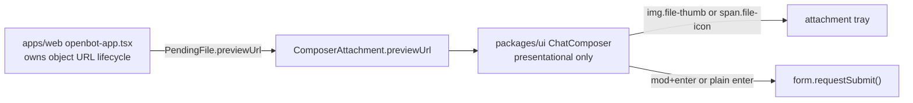

# Intent of the change

- Fifth PR of the seven-PR workspace UI stack. Composer only. Two files.
- `mod+enter` sends, alongside plain Enter. Neither replaces the other. Matches the reference build's keyboard table.
- Remove the "Shift + Enter for a new line" helper line. The reference build carries no helper copy; ADR-0021 makes the wording OpenBot's to keep or drop. The row now renders errors only, and renders nothing when there is no error.
- Image thumbnails for pending uploads. Driven by an observed defect: an image pick showed the same generic `↗` glyph as a PDF, so nothing in the tray was recognisable before the upload finished.
- Not a redesign. No new component, no new export, no dependency, no CSS.

# Architecture changes

- Boundary unchanged. `ChatComposer` stays presentational: it receives a blob URL and renders it. Minting and revoking object URLs belongs to the app, because the app owns `PendingFile` and knows when a pick is dropped.
- Enter handling splits into two named predicates rather than one condition. `modEnter` is `Enter` with meta or ctrl. `plainEnter` is `Enter` with no shift, no meta, no ctrl, and `!isComposing`. The IME guard applies to plain Enter only — a deliberate asymmetry, since `mod+enter` is never an IME commit key.
- Stack-split artifact, twice over. This commit ships the `previewUrl` field and its consumer, not its producer: `URL.createObjectURL` for `image/*` picks and the revoking `clearFiles` helper land in `apps/web/src/screens/openbot-app.tsx` one commit later, inside PR 55's message-blocks commit. On this commit alone `previewUrl` is always `undefined` and the tray still renders the glyph. Separately, the `.pending-file .file-thumb` rule (32px square, `object-fit: cover`, hairline shadow) was already written into `openbot-ui.css` by PR 51. The PR's own summary describes the whole feature; the diff carries one third of it.
- `mod+i` / `mod+l` focus-prompt shortcuts were scoped in the same composer-parity work item and also landed in PR 55's commit, not here.

# Summarized package changes

- `packages/ui` — `chat-composer.tsx` only. `ComposerAttachment` gains optional `previewUrl`. Tray renders `` when `previewUrl` is set, else the existing `↗`. Keydown gains the `modEnter || plainEnter` submit condition. The helper `` becomes a conditional error-only span. No export-surface change, no story change, no CSS.
- `apps/web` — `web-attachments.ts` only. `PendingFile` gains optional `previewUrl`. No producer in this commit.
- No changeset, no dependency change, no README change.

# Critical to apply to forks

yes

**Removed user-visible copy.** The string `Shift + Enter for a new line` no longer renders. Fork end-to-end tests, snapshot fixtures, and browser locators matching that text fail. The element also disappears from the DOM entirely when there is no error — a fork asserting on a stable node at that position needs a different anchor.

**New optional field on a published type.** `ComposerAttachment` and `PendingFile` each gain `previewUrl?: string`. Additive, so fork code typechecks unchanged, but a fork that builds composer attachment props from its own upload state gets no thumbnail until it mints the object URLs itself. A fork doing that owns the revoke: object URLs minted per pick and never revoked leak for the page's lifetime. The upstream revoke path is `clearFiles` in `apps/web/src/screens/openbot-app.tsx` — a fork on a diverged app screen must reimplement it, and it arrives with PR 55, not this one.

**Stylesheet dependency.** The thumbnail needs `.pending-file .file-thumb`. That rule lives in `packages/ui/src/openbot-ui.css` and arrived with PR 51. A fork that took this change without PR 51's stylesheet renders an unsized, uncropped image in the tray.

**Send keys widened, none removed.** Plain Enter still sends; shift+Enter still inserts a newline. A fork that rebound `mod+enter` to something else — insert newline, open a picker — now has a conflict inside the textarea and must reconcile it in `chat-composer.tsx`.

Run `pnpm install`, then `pnpm typecheck` and `pnpm lint`.
