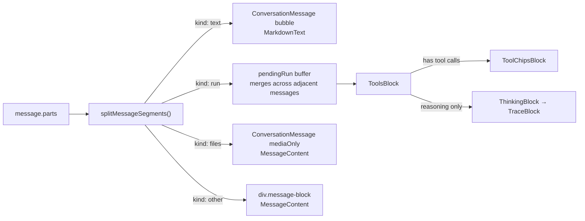

# Intent of the change

- **This PR is a rollup, not a feature.** Read that first. PRs 51–56 each merged into the next branch of the stack rather than onto `main`; only PR 50 reached `main` on its own. PR 55 was re-targeted from its stack parent to `main`, so its diff is the whole remaining stack — six commits — landing in one merge.
- Do not read this record as a description of six features. The other five commits are described where they belong: `docs/updates/51.md` (design tokens and theming), `52.md` (agent avatar engine), `53.md` (sidebar rows, account menu, palette actions), `54.md` (composer shortcuts and attachment thumbnails), `56.md` (first-run onboarding). This record covers only the commit PR 55 itself authored, plus the consequences of merging the stack as one unit.
- PR 55's own commit: **split assistant output into thinking, tool-chip and media blocks.** Chat bubbles carry text and nothing else. Reasoning and tool calls leave the bubble and become one grouped tool-chips block. Attachments become bare media rows. The chat header drops its status line and its two panel toggles.
- Reason: assistant turns had grown to carry reasoning, tool calls, and files inside the same bubble as prose, so a long tool run pushed the answer off screen and every part inherited bubble chrome it did not want.

# Architecture changes

- **One message no longer maps to one row.** `splitMessageSegments` in `packages/ui/src/message-blocks.tsx` walks `message.parts` and emits `text` / `run` / `files` / `other` segments. Adjacent text merges with a blank line between; `step-start` parts and empty reasoning are dropped; consecutive reasoning and tool parts collapse into one `run`. The transcript loop in `apps/web/src/screens/dispatch-app.tsx` renders segments, keyed `${message.id}:${index}` instead of `message.id`.
- **Runs merge across message boundaries.** A `pendingRun` buffer holds a run and absorbs the next message's run when the role is not `user`, flushing on any non-run segment. One agent turn spanning several assistant messages reads as one tool block rather than a stutter of small ones.
- **Message actions attach to the last text segment only.** Reply, thread, copy, and the overflow menu appear once per message, on its final bubble. Blocks and media rows carry no menu.
- **Segmentation is a pure function, exported.** `splitMessageSegments` takes `readonly MessagePart[]` and returns data. It has no React dependency, so mobile and desktop can reuse the split without inheriting web's transcript loop.
- **Tool presentation is heuristic on purpose.** `ToolsBlock` picks an icon by regex over the tool name (write/edit/create/patch/update, read/get/fetch/view/list/search/glob/grep, run/bash/shell/exec/command/test/build, think/reason/plan, else generic), and pulls the chip summary from the first present input key among `command`, `file_path`, `path`, `filename`, `file`, `query`, `url`, `cmd`. Chips truncate at 64 characters; details truncate at 14 lines. No tool registry, no per-tool component — an unknown tool degrades to a generic chip rather than failing to render. Pending, failed, and streaming states are read from `part.state` and `error_text`/`errorText`, tolerating both wire spellings.
- **Three new Beautiful UI blocks.** `trace-block.tsx` (thinking trace with active/done labels), `tool-chips-block.tsx` (grouped, expandable tool rows), `loader-grid.tsx` (pixel-grid loader plus `useElapsed`). They live under `beautiful-ui/blocks/`, which is Dispatch-authored composition — not `upstream/`, so ADR-0022's pristine-tree rule is untouched.
- **Chat header narrowed to one control.** `ChatHeaderProps` loses `status`, `conversationOutlineOpen`, `asyncTasksOpen`, `onToggleConversationOutline`, `onToggleAsyncTasks`, and gains `busy`. The agent avatar spins its orbit while the turn runs; liveness is shown, not spelled out. The computer toggle is the only button left.
- **Consequence not stated in the PR: two panels became unreachable.** `ConversationOutlinePanel` and the async tasks panel are still mounted and still render when open, but nothing sets them open any more — the header buttons were their only entry points. Their state hooks and close handlers remain in `dispatch-app.tsx` as dead UI.
- Also carried in this commit, belonging to PR 54's feature: the `URL.createObjectURL` producer for image picks, the revoking `clearFiles` helper, and the `mod+i` / `mod+l` focus-prompt shortcuts.

# Summarized package changes

- `packages/ui` — new `message-blocks.tsx` (`splitMessageSegments`, `ThinkingBlock`, `ToolsBlock`) and new `beautiful-ui/blocks/{trace-block,tool-chips-block,loader-grid}.tsx`. `chat-components.tsx`: `ChatHeader` prop surface narrowed to `busy` + computer toggle, avatar takes a `working` state, `EmptyConversation` suggestions rebuilt on the AI Elements `Suggestion`/`Suggestions` components. `message-content.tsx` and `rich-message-components.tsx` adjusted for media-only rendering. `index.ts` exports `splitMessageSegments`, `ThinkingBlock`, `ToolsBlock`, `TraceBlock` and their types.
- `apps/web` — `screens/dispatch-app.tsx` transcript loop rewritten around segments, run merging, and per-segment keys; header props updated; attachment object-URL lifecycle added.
- Rollup surface (not this commit's work — see the sibling records): `dispatch-ui.css` rewritten onto semantic tokens, `main.tsx` theme bootstrap, `agent-avatar.tsx` engine with `agent-avatar-shapes.ts` deleted, `sidebar-components.tsx` / `workspace-sidebar.tsx` / `use-workspace-layout.ts` rebuilt, `chat-composer.tsx` shortcuts and thumbnails, `onboarding.tsx` and `auth-gate.tsx` first-run flow, `stories/Workspace.stories.tsx` updated.
- No changeset in any of the six commits.

# Critical to apply to forks

yes

**This is a six-commit merge, not one feature.** A fork syncing `main` takes tokens, theming, the avatar engine, the sidebar rebuild, composer changes, transcript segmentation, and onboarding in a single step. Every fork-critical item from `docs/updates/51.md` through `54.md` and `56.md` applies at this merge. Read those records before merging; this one does not repeat them.

**`ChatHeaderProps` is a breaking prop change.** `status` is gone — a fork passing it gets a typecheck error, and any fork surface that showed "Online" or a turn status in the header has nowhere to put it; use `busy` and the avatar state, or render the string outside the header. `conversationOutlineOpen`, `asyncTasksOpen`, `onToggleConversationOutline`, and `onToggleAsyncTasks` are gone too.

**Two panels lose their only entry point.** Nothing opens the conversation outline or the async tasks panel after this merge. A fork that depends on either must add its own trigger — a palette action or a keyboard shortcut — or the panels are dead code in the fork as well.

**Transcript DOM and keys changed.** One message can now render as several rows; React keys moved from `message.id` to `${message.id}:${index}`; text renders through `MarkdownText` inside the bubble instead of `MessageContent`; attachments render in a `mediaOnly` bubble with no chrome; other parts render in a bare `div.message-block`. Fork end-to-end tests, screenshot baselines, and browser locators keyed on one-bubble-per-message or on `message.id` break. The message action menu now exists only on a message's last text bubble.

**Fork code that renders parts itself should adopt the split.** `splitMessageSegments` is exported and framework-neutral. A fork with its own transcript renderer keeps working — nothing was removed from `MessageContent` — but will drift visually from upstream and should call the splitter rather than reimplement the merge rules.

**Tool naming is heuristic, not registered.** A fork whose tools are named outside the regex families get the generic icon and no chip summary unless the tool input carries one of the recognised keys. Adjust the regexes in `packages/ui/src/message-blocks.tsx` rather than adding a parallel renderer.

Run `pnpm install`, then `pnpm typecheck` and `pnpm lint`. Because this merge lands the whole stack, also re-run any fork screenshot or end-to-end suite that touches the sidebar, composer, transcript, or first-run path — a typecheck pass says nothing about six commits of visual change.
