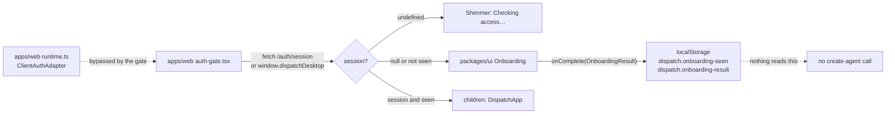

# Intent of the change

- Top of the seven-PR workspace UI stack. First-run onboarding, behind the auth gate.
- Six steps plus a hand-off frame: `landing` → `meet` → `computer-demo` → `jobs` → `tools` → `create` → `hand-off`. Sign in, a short introduction, a tool picker, name and style your first bot, then the app swaps in.
- The step machine and its timing mirror the reference build's first-run structure; every user-visible string is Dispatch's own, per ADR-0021. Structure borrowed, wording not.
- Replace the single sign-in card. Before this, `auth-gate.tsx` had three states — checking, signed out, children — and no product introduction at all.
- Colour swatches come from `agentAvatarPalette` (PR 52), not a second hardcoded list, so a picked colour renders identically wherever the bot appears.
- Runs once. Two `localStorage` keys carry the flag and the result.

# Architecture changes

- `Onboarding` is a single self-contained component in `packages/ui/src/onboarding.tsx`, 551 lines, exported with `OnboardingProps`, `OnboardingResult`, `OnboardingStep`. It owns its own step index, tool selection, name, colour, shape, and hand-off state. The app passes `signedIn`, `signingIn`, `error`, three callbacks, and an optional status line — no store, no router, no fetch inside the component.
- `landing` auto-advances to `meet` once `signedIn` flips, so a returning user who is already authenticated never sees a redundant sign-in frame. `back` floors at index 1: you cannot walk back into sign-in.
- `finish` races `onComplete` against a 1500 ms minimum dwell so the hand-off frame is readable rather than a flash. Same dwell as the reference build.
- Ownership split follows ADR-0023: the package holds markup, motion, and step state; the app holds the session load, the redirect, and the `localStorage` writes. No fetch inside `onboarding.tsx`.
- Persistence is deliberately lenient. `readSeen` returns `true` on a `localStorage` throw and the write is wrapped in a swallowed `try`, so a private-mode or storage-disabled browser proceeds into the app instead of looping on onboarding forever. The trade: onboarding silently never runs there.
- **The gate stopped using the shared client runtime.** The previous `auth-gate.tsx` read `state.auth` from `dispatchRuntime.store` and called `dispatchRuntime.actions.initialize()`. It now calls `fetch("/auth/session")` directly and branches on `window.dispatchDesktop` itself. `apps/web/src/runtime.ts` still builds a `ClientAuthAdapter` with exactly that web/desktop branch and still hands it to `createDispatchRuntime`. Two auth paths now exist in one app and only one of them is used by the gate. This is in tension with ADR-0017, which makes the runtime mandatory for major UX surfaces and state interactions.
- **The onboarding result is a dead end.** `OnboardingResult` — name, colour, shape, selected tools — is JSON-stringified into `dispatch.onboarding-result` and nothing at `HEAD` reads that key. No agent is created, no tool grant is issued. The tool picker records preferences that reach nothing.
- The tool list is 20 hardcoded strings with letter-initial tiles. No connector registry, no icons, no availability check.
- `computer-demo` and `jobs` are static illustrations: a mock window with traffic lights and grey tiles, and three positioned avatars with job labels. `aria-hidden`, no animation loop, no cursor choreography. The reference build's scene animation was deliberately skipped.

# Summarized package changes

- `packages/ui` — new `onboarding.tsx`: `Onboarding` plus internal `Landing`, `Meet`, `StepFrame`, `ComputerDemo`, `JobsScene`, `ToolsGrid`, `CreateBot`. Built on `AgentAvatar`, `agentAvatarPalette`, the `Button` and `Shimmer` atoms, and semantic token utilities. `index.ts` exports `Onboarding`, `OnboardingProps`, `OnboardingResult`, `OnboardingStep`.
- `apps/web` — `auth-gate.tsx` rewritten: local `Session` type, `loadSession` over `fetch("/auth/session")` with a `window.dispatchDesktop.authStatus()` branch, `signIn` over `/auth/login` with a desktop branch, `seen` flag from `localStorage`, `Onboarding` rendered for both signed-out and not-yet-onboarded states. `dispatchRuntime` import dropped from this file.
- No CSS, no story, no test, no changeset, no dependency change.

# Critical to apply to forks

yes

**A fork's users see a first-run flow they did not write.** Seven frames of Dispatch product copy — "Dispatch", "Stand up a bot, hand it the work you keep putting off.", "Every bot gets its own computer", "One bot, one job", "Which tools should your bots reach?", "Set up your bot" — render before a fork's app does, for every existing user, because the `dispatch.onboarding-seen` key has never been set. A rebranded fork must pass its own copy or replace the component; there is no prop for the strings today, so replacing means forking `onboarding.tsx` or rendering something else from the gate.

**The sign-in card is gone.** A fork that customized the old `auth-gate.tsx` sign-in panel — its wording, its button, its error placement — loses that markup entirely on merge. The equivalent is now `Landing` inside `packages/ui/src/onboarding.tsx`.

**The gate no longer goes through the client runtime.** `auth-gate.tsx` calls `fetch("/auth/session")` and `window.dispatchDesktop` directly. A fork that swapped in its own `ClientAuthAdapter` in `apps/web/src/runtime.ts` — a different session endpoint, a different sign-in redirect, a non-Electron desktop bridge — finds the gate ignoring it. Either reroute the gate through `dispatchRuntime` or apply the same change twice. Check this before assuming a fork's auth still works.

**Two new `localStorage` keys are owned by this feature:** `dispatch.onboarding-seen` and `dispatch.onboarding-result`. A fork with its own first-run flag must reconcile, or users get both. Clearing site data replays onboarding.

**The tool picker grants nothing.** Do not ship it to fork users as a permissions or connector step. The selection is written to `localStorage` and read by nothing; no tool is enabled, no scope is requested.

**New published exports.** `Onboarding`, `OnboardingProps`, `OnboardingResult`, `OnboardingStep` from `@trytilde/dispatch-ui`. Additive.

Run `pnpm install`, then `pnpm typecheck` and `pnpm lint`. Then sign in on a browser profile with cleared storage and walk all seven frames on both the web and desktop targets — the desktop branch of `loadSession`/`signIn` has no automated coverage.
