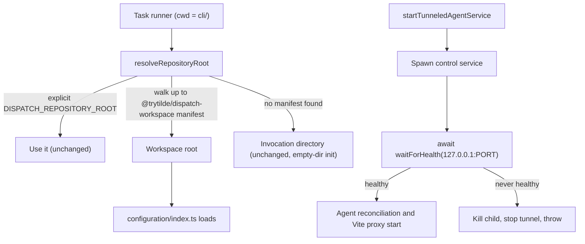

# Intent of the change

- Fork dev run broke at startup. Task runner start CLI inside `cli/`, so root resolve wrong and loader look for `cli/configuration/index.ts`. Fix at owning seam, not at loader.
- Dev startup shout `ECONNREFUSED 127.0.0.1:4100` for `/auth/login` and `/api/chat/*`. Cause: dependent traffic start before control service listen. Wait for health instead.
- Root workspace import `@trytilde/dispatch-auth-provider` but never declare it. Declare it.
- Computer image test match literal `dispatch-computer`, so any fork with other repository name fail. Match shape, not name.
- `@trytilde/dispatch-ui` render with `react-dom`, so declare it peer.
- All five carried in a downstream fork before this PR. Home is upstream, so fork stop holding shared functionality.

# Architecture changes

- Boundaries unchanged. CLI still own root resolution and dev startup order. Control-service provider still own `waitForHealth`; this PR reuse it, no new service, no new dependency, no new provider role.
- Root discovery key on manifest name `@trytilde/dispatch-workspace`. Explicit override still win first. No manifest anywhere up the chain still fall back to invocation directory, so `tilde init` in empty directory behave same.
- Health wait sit on both dev paths: direct child and local-runtime tunnel. Failure now loud at startup instead of quiet proxy errors later.
- No HTTP, ConnectRPC, or protobuf surface touched. No ADR needed; ADR-0018 already govern developer workflow.

# Summarized package changes

- `@trytilde/cli`
  - `src/paths.ts`: add `findDispatchWorkspaceRoot`, walk upward from invocation directory, read each `package.json`, stop at name `@trytilde/dispatch-workspace`. Unreadable manifest keep walking.
  - `src/paths.test.ts`: new case build temp workspace with `cli/` child and prove root discovered from inside package.
  - `src/commands/dev.ts`: import `waitForHealth`; await it after direct spawn (kill child on failure) and after tunnel connect (kill command, stop tunnel on failure).
- Workspace root
  - `package.json`: declare `@trytilde/dispatch-auth-provider` dependency.
  - `pnpm-lock.yaml`: lockfile follow the new root link.
- `@trytilde/dispatch-computer-service-provider`
  - `src/base.test.ts`: image summary regex now `/locally built [^\s/]+\/[^\s]+-computer computer image/`, so fork repository name no longer break it.
- `@trytilde/dispatch-ui`
  - `package.json`: add `react-dom: ">=19"` peer dependency.
- Release
  - `.changeset/fix-fork-development-reliability.md`: patch.
- Proof
  - `pnpm check`: 0 errors, 21 pre-existing warnings.
  - `pnpm --filter @trytilde/cli test`: 24 files, 117 tests passed.
  - `pnpm --filter @trytilde/dispatch-computer-service-provider test`: 2 files, 19 tests passed.
  - `pnpm build`: passed with `verify:packages` and `verify:cli`.

# Critical to apply to forks

yes

Fork that run `tilde dev` through the workspace task runner hit the startup failure and the connection-refused race directly, and any fork whose repository is not named `dispatch` hit the image test failure.

Fork action:

- Take this update. No migration, no secret change, no deployment state change.
- Drop local copies of these fixes. A fork carrying its own `paths.ts` root walk, its own `dev.ts` health wait, or its own root `auth-provider` entry now duplicate upstream and will conflict on the next sync.
- Fork that rename the root package away from `@trytilde/dispatch-workspace` keep old behavior: root resolve fall back to invocation directory. Rename back or set `DISPATCH_REPOSITORY_ROOT`.
- Run `pnpm install` after update so the new root workspace link land in the fork lockfile.
