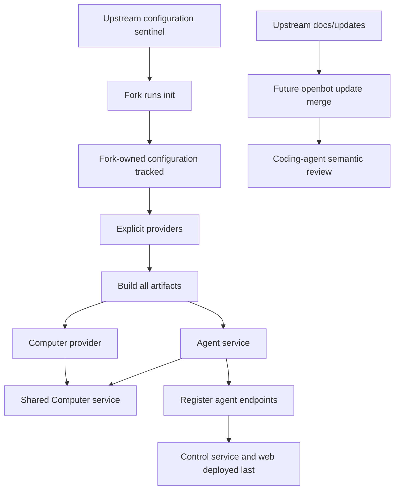

# OpenBot provider runtime and fork workflow

## Intent of the change

- Reset from owner UX down. Old server/provider maze gone.
- Provider contracts stay internal TypeScript. RPC only for real service boundaries.
- Fork owns configuration, agents, tools, skills, secrets, deployment choices.
- Dev, local production, Vercel production share provider lifecycles.
- Agent service split from control service. Agent edits avoid control rebuild.
- Computer tools explicit, typed, Zod-backed. No raw fetch. No hidden agent ID input.
- Fresh upstream checkout hides configuration. Init exposes and scaffolds it only in a fork.
- Future init also creates owner repository. Future update consumes upstream notes and demands semantic review.

## Architecture changes

- `apps/control-service`: bare Hono control/web boundary. Empty owner proto for now.
- `apps/computer-service`: one internal typed Computer API. Static SOPS key required.
- `packages/*-provider`: contract in `core.ts` or `core/index.ts`; implementation beside contract. No separate core packages.
- `packages/runtime-provider`: build/deploy coordinator. Build first. Runtime last.
- `packages/control-service-provider`: local and Vercel control/web artifacts.
- `packages/agent-service-provider`: local combined agent server; parallel independent Vercel functions.
- `packages/computer-provider`: Microsandbox/Vercel Sandbox, shared image, typed agent tools, workspace seed.
- `packages/configuration`: explicit seven-provider composition. Runtime-safe provider subset separate.
- `cli`: Ink + arg commands for init, dev, new-agent, secrets, build/deploy lifecycle.
- `configuration/`: upstream tracks only an ignore-all `.gitignore`. Successful fork init removes that exact sentinel after scaffolding.
- Desktop stays client. Never starts control service.
- Root env and root SOPS forbidden. Fork values only under `configuration/`.

## Summarized package changes

- `@openbot/agent-provider`: agent/session/message boundary; Tilde Harness SDK adapter; prompt/tool hooks.
- `@openbot/agent-service-provider`: discover Eve-shaped agents; instrumentation ordering; local server; parallel Vercel functions; registration inputs.
- `@openbot/computer-provider`: singular package; build/deploy OCI image; Microsandbox and Vercel implementations; shell, await, files, copy, glob, grep, screenshot tools.
- `@openbot/computer-service-proto`: internal lifecycle, execution, file, desktop, ports, VNC transport. Background/await included.
- `@openbot/configuration`: all seven roles mandatory; `RuntimeProviders` keeps deployment compilers out of agent bundles.
- `@openbot/control-service-proto`: intentionally empty owner contract.
- `@openbot/control-service-provider`: provider-owned Handlebars assets; local systemd/launchd; Vercel Build Output API.
- `@openbot/inference-model-provider`: explicit OpenAI API-key and OAuth constructors.
- `@openbot/runtime-provider`: optional `Buildable` and `Deployable`; secret classes; sandbox aggregation; runtime-last order.
- `@openbot/skills-provider`: core skill boundary and Tilde implementation.
- `@openbot/tools-provider`: Vercel AI SDK tools and Tilde implementation.
- `@openbot/utilities`: strict Handlebars file templates.
- `@openbot/cli`: SOPS identities, provider setup, agent scaffolding, dev supervisor, selective deployment, and safe upstream-sentinel removal after successful init.
- Init refuses to delete a custom fork-owned `configuration/.gitignore` and stops before writing `.env`.
- Upstream `configuration/.gitkeep` removed. Ignore-all `configuration/.gitignore` added.
- README, CLI README, configuration docs, and ADR-0001 document commit and merge behavior.
- Removed legacy server, Box API, providers/provider-sdk, database/contracts, root Vercel files, setup code, global configuration skills/sandbox.
- ADR-0013 adds repository bootstrap, mandatory upstream update records, fork merge notes, future Git provider, future automatic coding-agent launch.
- Update generation opened all 391 locally indexed coding-agent rollout files and analyzed 80,649 readable user/assistant messages. Thirty malformed JSONL lines could not be parsed; no raw or unrelated thread content was copied.

## Critical to apply to forks

yes

- Fork must move provider imports to consolidated owning packages. Old core/provider SDK imports fail.
- Fork must rename Box/server terminology to Computer/control service.
- Fork must preserve its own `configuration/`; upstream configuration examples are intentionally deleted.
- Existing initialized forks must keep their configuration tracked and must not restore upstream `configuration/.gitignore`.
- New forks must run init, then commit both the generated configuration and deletion of the sentinel. Ordinary upstream merges preserve that committed deletion while upstream leaves the sentinel unchanged.
- Fork must recreate explicit seven-provider composition and runtime-provider subset through init or manual migration.
- Fork must move agent skills and workspace seeds under `configuration/agents/<id>/`.
- Fork must use explicit generated Computer tool files and typed computer-service calls.
- Fork must move secrets/env from repository root into `configuration/.env` and `configuration/secrets.enc.yaml`; `.env` stays ignored.
- Fork must review deployment topology: agent service, Computer, agent registration, development sandbox, control runtime.
- Fork must verify desktop points at separately run or deployed control service.
- Fork must read ADR-0001 and ADR-0004 through ADR-0013 before resolving conflicts.
- Fork must run `pnpm check` and `pnpm build`, then test its critical customized behavior.
