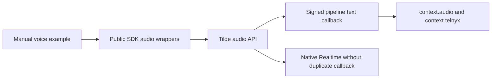

# ChatKit realtime voice SDK

## Intent of the change

Expose the companion Tilde voice API through the current public SDK packages and
provide a manually runnable browser/Telnyx agent example.

## Architecture changes

ADR review: no new decision in Dispatch. This follows ADR 0030's SDK ownership
and the API's ADR 0023 agent-owned speech orchestration. Typed signed speech
context is validated before it reaches the ordinary endpoint callback.

## Summarized changes

- SDK: agent audio registration/configuration, retrieval, browser admission, and
  Telnyx route binding using camelCase inputs and the API's typed wire fields.
- Node adapter: verified speech context, current-user-turn context selection, and
  interrupted generated-speech annotations during history conversion.
- Example: two agents, current package names and AI SDK 7, explicit agentLoop
  response mode, local microphone/player, and carrier setup instructions.
- Package READMEs and minor Changeset for both public SDK packages.
- No application client, provider composition, protobuf, or fork configuration changes.
- Generated contracts are intentionally not replaced with the older API branch
  snapshot. After API PR 277 is rebased, regenerate from its complete current-main
  contract before release; no generated file was hand-edited.

Validation: SDK and Node-adapter typechecks and builds pass; core 129 tests and
Node-adapter 156 tests pass. Package lint completes with existing warnings. The
manual example typechecks and its server serves the microphone tester. Live
OpenAI inference was tested in the API worktree; real Telnyx and browser
microphone interactions remain manual checks. Full application checks/builds
were not run for this isolated SDK contribution.

## Critical to apply

yes

Resolve/revalidate API PR 277, refresh the complete generated contract from that
API head, deploy its migrations and voice routes, then release these SDK packages
and publish docs PR 37. The raw generated API client does not yet expose the new
voice operations in this draft; the hand-authored wrappers implement them.

Speech configuration is portable agent intent; credentials stay server-side and
example registration secrets are ignored. Media tokens are ephemeral. Telnyx
routing is installation-specific. Native endpoint-tool bridging, browser
personal-tool federation, direct WebRTC/SIP, ElevenLabs, recordings, and voice
notes are outside this slice.

Related: https://github.com/trytilde/api/pull/277 and
https://github.com/trytilde/docs/pull/37.
