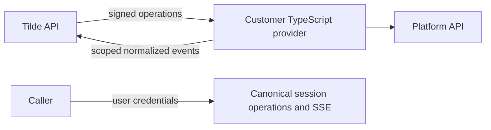

# Customer-hosted ChatKit SDK

PR: Pending

## Intent of the change

Bring the custom ChatKit provider implementation into Dispatch's supported SDK
packages so customers can host complete transports and contextual tools using
`@trytilde/sdk`, with no dependency on the archived Harness SDK repository.

## Architecture changes

See [ADR-0043](../../adrs/0043-custom-chatkit-provider-sdk.md), extending ADR-0030,
ADR-0038, and ADR-0042. Tilde owns authorization and canonical durable execution;
customer backends own platform behavior. SDK, connection-runtime, and user-client
credentials remain separate.

## Summarized changes

- Port provider authoring/runtime, definition and connection management, rich
  delivery, work diagnostics, and canonical session streams to `packages/sdk`.
- Integrate dynamically discovered custom tools into the existing Vercel AI
  `context.session.tools` object and export `sessionProviderTools`.
- Preserve newer room, run, identity, and client APIs. Add the Linq/AgentMail
  reference implementations and streaming example under the owning SDK package.
- Regenerate contracts from API PR https://github.com/trytilde/api/pull/276.
  Companion public docs: https://github.com/trytilde/docs/pull/36.
- Metadata classification: provider-specific external thread/message details are
  interpreted only by the Linq or AgentMail reference adapter. The SDK forwards
  opaque extension objects; canonical routing, credentials, leases, and execution
  IDs use the signed typed contract, not metadata.
- No OpenBot client surface or fork-owned configuration is changed. No new
  external service or global tool install is required; the existing Node 24
  toolchain is used and Ajv reuses the repository's current dependency version.
- Validation on Dispatch `fcee72c`: `openbot sdk refresh` regenerated the client,
  validated 689 operations, built all SDK packages, and passed 315 SDK tests.
  A subsequent custom endpoint test brings the validated aggregate to 316:
  core SDK 150, Vercel Node 152, and other SDK packages 14. `openbot sdk validate`
  passed package/export validation; the final changed SDK packages were rebuilt.
- Focused typechecking, example typechecking, formatting, and lint pass. Existing
  no-base-to-string warnings remain in older portions of the webhook test file.
  Full OpenBot application check/build and browser/Electron e2e were not run
  because this changes server SDK packages rather than application surfaces.

## Critical to apply

yes

Deploy the additive API and upgrade workers before releasing the SDK or enabling
custom providers. Consumers use `@trytilde/sdk/chatkit-provider` and configure
backend signing keys, per-connection runtime tokens, and durable backend state.
The reference host's setup guide covers the manually provisioned AgentMail
webhook. No publication, deployment, or live-platform/browser e2e is included.
