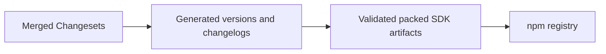

# Publish the organization identity SDK release

PR: Pending

## Intent of the change

Release the merged runtime identity, managed-linking and server proxy APIs so applications can install supported registry packages instead of local snapshots.

## Architecture changes

ADR review: no new decision. This applies the existing [org identity SDK contract](../../adrs/0042-org-runtime-identities.md) using the repository's generated Changesets release plan.

## Summarized changes

- Generated SDK/API-client 0.3.0, React/Vercel adapters 2.0.0, and harness adapters 0.2.0 using Changesets; retained the coordinated workspace version updates required by the release plan.
- Updated the lockfile; all ten SDK package builds/artifact checks and all 291 SDK-family tests passed.
- Package publication uses pnpm-produced tarballs with npm's browser authentication, preserving resolved workspace dependencies and publish exports.
- Registry publication and replacement of HeyAsh snapshots are recorded after completion; no application deployment or database reset is performed by this version change.
- Cross-client parity: no client capability changed. External dependencies and metadata semantics are unchanged.

## Critical to apply

yes

Upgrade the SDK/API client and their React/Vercel adapters together. The org proxy and identity APIs require the matching merged Tilde API. Applications must keep proxy credentials on the server and use verified session-derived identity/team scope. Coordinate the fresh deployment before removing the existing application deployment/webhook holds.
